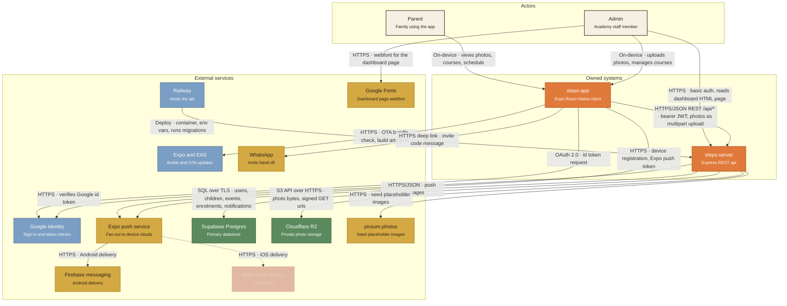

# Steps — system context (C4 level 1)

This diagram shows every external service the Steps product talks to and what crosses each wire, with the two codebases in this repository as single boxes. Internal structure — screens, routes, controllers, components — is deliberately out of scope; this is an integration map, not a code map.

## Diagram

**Legend.** Solid line, full-opacity box = **live** (code exists and runs). Solid line, `flagged off` tag = **scaffolded** (code exists but is disabled). Dashed line, reduced-opacity box = **planned** (decided, no working credential or code path yet).

## Integration table

| Service | Who talks to it | Direction | Protocol | Data crossing the wire | Auth / secret | Status |
|---|---|---|---|---|---|---|
| Supabase Postgres | steps-server | out | SQL over TLS (Prisma / pg) | Users, children, guardianship links, events, photo records, tags, courses, enrolments, notifications, invite codes, analytics events | `DATABASE_URL`, `DIRECT_URL` — `prisma/schema.prisma:5-9` | live |
| Cloudflare R2 | steps-server | out | S3 API over HTTPS | Photo bytes on write (thumb, medium, original); short-lived signed GET urls on read | `R2_ACCESS_KEY_ID`, `R2_SECRET_ACCESS_KEY`, `R2_ENDPOINT`, `R2_BUCKET_NAME` — `src/lib/r2.ts:6-8` | live |
| Expo push service | steps-app, steps-server | out (both) | HTTPS/JSON | App: device registration, receives Expo push token. Server: push messages — title, body, data, channelId, priority | Expo push token per device; no server secret | live |
| Firebase Cloud Messaging | Expo push service | out | HTTPS | Android notification delivery | FCM V1 service account key held by Expo; `google-services.json` in the build — `app.json` `android.googleServicesFile` | live |
| Apple Push Notification service | Expo push service | out | HTTPS | iOS notification delivery | APNs key — **none issued**; no Apple Developer Program membership, no iOS credential on the EAS credentials page | planned |
| Google identity | steps-app, steps-server | out (both) | OAuth 2.0 over HTTPS | App: id token request via `expo-auth-session`. Server: verifies that id token | `EXPO_PUBLIC_GOOGLE_*_CLIENT_ID` — `src/app/auth.tsx:139-143`; `GOOGLE_CLIENT_ID` — `src/controllers/authController.ts:3,11` | live |
| Expo / EAS | steps-app | out | HTTPS | OTA bundle check and download; build artefacts and credentials | EAS project id `c42cd810-…` — `app.json` `extra.eas.projectId`, `updates.url` | live |
| Railway | steps-server | in (deploy) | Platform deploy | Container build from git, environment variables, `prestart` runs `prisma migrate deploy` | Railway account; `RAILWAY_*` read for diagnostics — `src/config/env.ts` | live |
| WhatsApp | steps-app | out | HTTPS deep link | Invite code and child name in a prefilled message | None — hands off to the installed app — `src/app/invite-send.tsx:102` | live |
| Google Fonts | Admin's browser | out | HTTPS | Nunito webfont for the server-rendered admin dashboard page | None — `src/controllers/dashboardController.ts:268-270` | live |
| picsum.photos | steps-server | out | HTTPS | Placeholder image urls written onto seeded photo rows | None — `src/devSeed.ts:100`; `runDevSeed` is dev-only, and 23 legacy rows still reference it | scaffolded |

### Corrections to the brief

Three services were described in the request in a state the code no longer matches. Status above is taken from the code, as instructed.

- **`AUTH_ENABLED` is `true`**, not false — `steps-app/src/constants/flags.ts:5`. Google identity and the JWT-bearing arrow are **live**, not scaffolded.
- **The user store is Prisma against Postgres**, not an in-memory `Map` — 15 `prisma.` calls in `src/models/user.ts`, 18 applied migrations. Postgres is **live**, not planned.
- **TanStack Query is used in 22 files.** It remains correctly excluded from the diagram: it is a client library, not a third party over a wire.

## How to update this

1. Edit the Mermaid block above — it is the canonical source.
2. Mirror the same change in `system-context.svg` (hand-authored; node and edge geometry is laid out manually).
3. `system-context.html` embeds the SVG at build time via the snippet in the commit that created it; regenerate it by re-embedding the SVG between the existing header and footer, or edit the inline `<svg>` in place.
4. Update the integration table, including the file reference and the status.

All three files must describe the identical set of nodes and arrows. **15 nodes, 17 edges.** If those counts drift apart, one of the files is stale.
